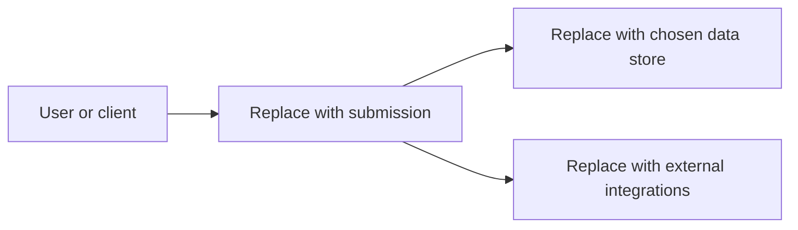

# Architecture

Prompt: Replace the placeholder nodes and connections with the entry's current architecture; keep the diagram as Mermaid so it remains reviewable as text.

<!-- PLACEHOLDER - replace this diagram during the event. -->

